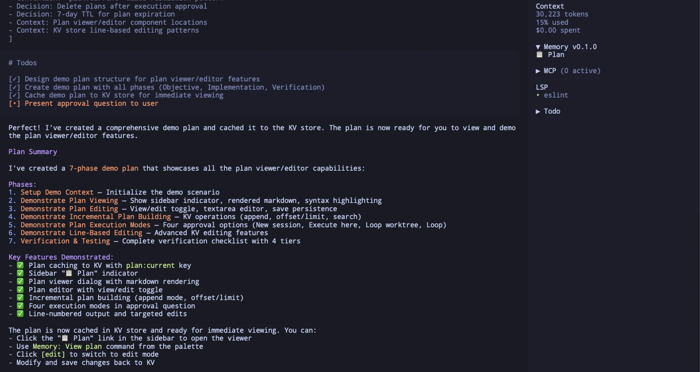
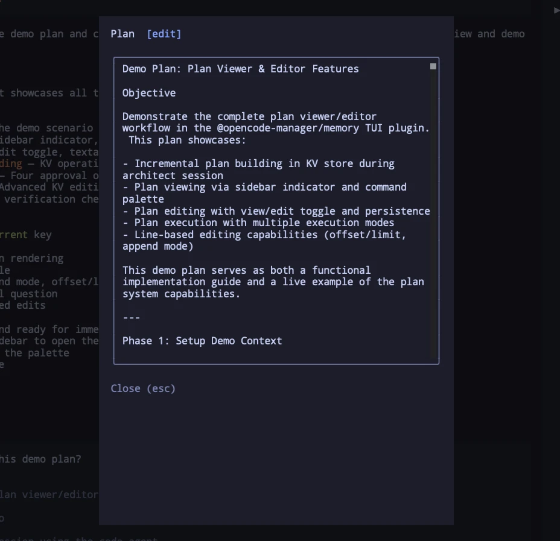
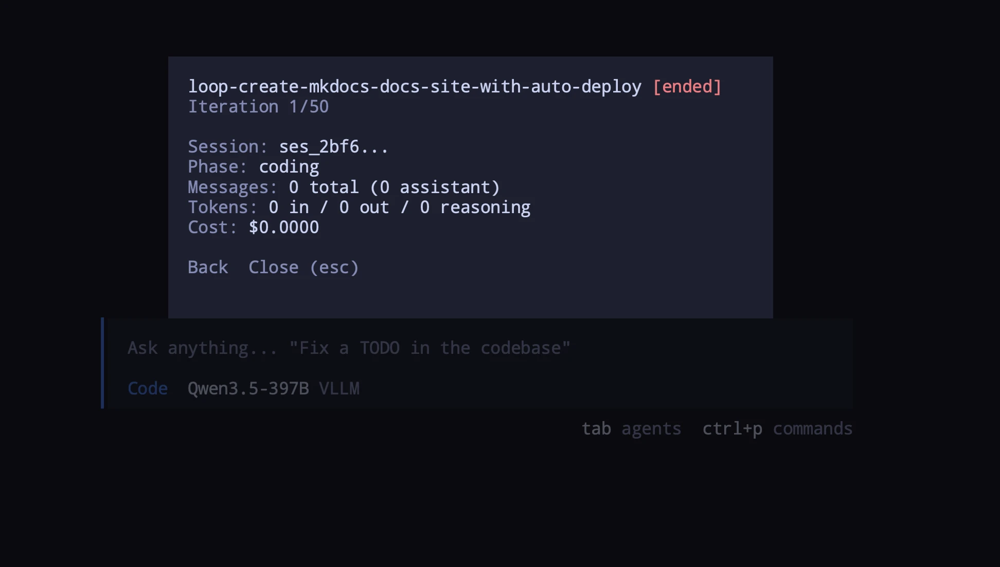

<h1 align="center">@opencode-manager/memory</h1>

<p align="center">
  <strong>Semantic memory and planning plugin for <a href="https://opencode.ai">OpenCode</a> AI agents</strong>
</p>

<p align="center">
  <a href="https://www.npmjs.com/package/@opencode-manager/memory"></a>
  <a href="https://www.npmjs.com/package/@opencode-manager/memory"></a>
  <a href="https://github.com/chriswritescode-dev/opencode-memory/blob/main/LICENSE"></a>
</p>

## Quick Start

```bash
pnpm add @opencode-manager/memory
```

Add to your `opencode.json`:

```json
{
  "plugin": ["@opencode-manager/memory"]
}
```

The local embedding model downloads automatically on install. For API-based embeddings (OpenAI or Voyage), see [Configuration](#configuration).

## Features

- **Semantic Memory Search** - Store and retrieve project memories using vector embeddings
- **Multiple Memory Scopes** - Categorize memories as convention, decision, or context
- **Automatic Deduplication** - Prevents duplicates via exact match and semantic similarity detection
- **Compaction Context Injection** - Injects conventions and decisions into session compaction for seamless continuity
- **Automatic Memory Injection** - Injects relevant project memories into user messages via semantic search with distance filtering and caching
- **Session Plan Storage** - Session-scoped plan storage with 7-day TTL for managing implementation plans
- **Bundled Agents** - Ships with Code, Architect, Auditor and Librarian agents preconfigured for memory-aware workflows
- **CLI Tools** - Export, import, list, stats, cleanup, upgrade, status, cancel, and restart commands via `ocm-mem` binary
- **Dimension Mismatch Detection** - Detects embedding model changes and guides recovery via reindex
- **Iterative Development Loops** - Autonomous coding/auditing loop with optional worktree isolation, session rotation, stall detection, and review finding persistence
- **Docker Sandbox** - Run loops inside isolated Docker containers with bind-mounted project directory, automatic container lifecycle, and selective tool routing (bash, glob, grep)

## Agents

The plugin bundles four agents that integrate with the memory system:

| Agent | Mode | Description |
|-------|------|-------------|
| **code** | primary | Primary coding agent with memory awareness. Checks memory before unfamiliar code, stores architectural decisions and conventions as it works. Delegates planning operations to @librarian subagent. |
| **architect** | primary | Read-only planning agent. Researches the codebase, delegates to @librarian for broad knowledge retrieval, designs implementation plans, then hands off to code via `plan-execute`. |
| **librarian** | subagent | Expert agent for managing project memory. Handles post-compaction memory extraction and contradiction resolution. |
| **auditor** | subagent | Read-only code auditor with access to project memory for convention-aware reviews. Invoked via Task tool to review diffs, commits, branches, or PRs against stored conventions and decisions. |

The auditor agent is a read-only subagent (`temperature: 0.0`) that can read memory but cannot write, edit, or delete memories or execute plans. It is invoked by other agents via the Task tool to review code changes against stored project conventions and decisions.

The architect agent operates in read-only mode (`temperature: 0.0`, all edits denied) with message-level enforcement via the `experimental.chat.messages.transform` hook. Plans are built incrementally in the KV store during the planning session. After approval, execution is dispatched programmatically — no additional LLM calls are needed. The user can view and edit the cached plan from the sidebar or command palette before or during execution. 


## Tools

### Memory Tools

| Tool | Description |
|------|-------------|
| `memory-read` | Search and retrieve project memories with semantic search |
| `memory-write` | Store a new project memory |
| `memory-edit` | Update an existing project memory |
| `memory-delete` | Delete a project memory by ID |
| `memory-health` | Check plugin health, reindex embeddings, upgrade plugin, or reload without restart |
| `plan-execute` | Create a new Code session and send an approved plan as the first prompt |

### Plan Tools

Session-scoped plan storage with 7-day TTL for managing implementation plans.

| Tool | Description |
|------|-------------|
| `plan-write` | Store the entire plan content. Auto-resolves key to `plan:{sessionID}`. |
| `plan-edit` | Edit the plan by finding `old_string` and replacing with `new_string`. |
| `plan-read` | Retrieve the plan. Supports pagination with offset/limit and pattern search. |

### Review Tools

Review finding storage for persisting audit results across session rotations.

| Tool | Description |
|------|-------------|
| `review-write` | Store a review finding with file, line, severity, and description. Auto-injects branch field. |
| `review-read` | Retrieve review findings. Filter by file path or search by regex pattern. |
| `review-delete` | Delete a review finding by file and line. |

### Loop Tools

Iterative development loops with automatic auditing. Defaults to current directory execution; set `worktree: true` for isolated git worktree.

| Tool | Description |
|------|-------------|
| `memory-loop` | Execute a plan using an iterative development loop. Default runs in current directory. Set `worktree` to true for isolated git worktree. |
| `memory-loop-cancel` | Cancel an active memory loop by worktree name |
| `memory-loop-status` | List all active memory loops or get detailed status by worktree name. Supports `restart` to resume inactive loops. |

## Slash Commands

| Command | Description | Agent |
|---------|-------------|-------|
| `/review` | Run a code review on current changes | auditor (subtask) |
| `/memory-loop` | Start a memory iterative development loop in a worktree | code |
| `/memory-loop-status` | Check status of all active memory loops | code |
| `/memory-loop-cancel` | Cancel the active memory loop | code |

## CLI

Manage memories using the `ocm-mem` CLI. The CLI auto-detects the project ID from git and resolves the database path automatically.

```bash
ocm-mem <command> [options]
```

**Global options** (apply to all commands):

| Flag | Description |
|------|-------------|
| `--db-path <path>` | Path to memory database |
| `--project, -p <name>` | Project name or SHA (auto-detected from git) |
| `--dir, -d <path>` | Git repo path for project detection |
| `--help, -h` | Show help |

### Commands

#### export

Export memories to file (JSON or Markdown).

```bash
ocm-mem export --format markdown --output memories.md
ocm-mem export --project my-project --scope convention
ocm-mem export --limit 50 --offset 100
```

| Flag | Description |
|------|-------------|
| `--format, -f` | Output format: `json` or `markdown` (default: `json`) |
| `--output, -o` | Output file path (prints to stdout if omitted) |
| `--scope, -s` | Filter by scope: `convention`, `decision`, or `context` |
| `--limit, -l` | Max number of memories (default: `1000`) |
| `--offset` | Pagination offset (default: `0`) |

#### import

Import memories from file.

```bash
ocm-mem import memories.json --project my-project
ocm-mem import memories.md --project my-project --force
```

| Flag | Description |
|------|-------------|
| `--format, -f` | Input format: `json` or `markdown` (auto-detected from extension) |
| `--force` | Skip duplicate detection and import all |

#### list

List all projects with memory counts.

```bash
ocm-mem list
```

#### stats

Show memory statistics for a project (scope breakdown).

```bash
ocm-mem stats
ocm-mem stats --project my-project
```

#### cleanup

Delete memories by criteria.

```bash
ocm-mem cleanup --older-than 90
ocm-mem cleanup --ids 1,2,3 --force
ocm-mem cleanup --scope context --dry-run
ocm-mem cleanup --all --project my-project
```

| Flag | Description |
|------|-------------|
| `--older-than <days>` | Delete memories older than N days |
| `--ids <id,id,...>` | Delete specific memory IDs |
| `--scope <scope>` | Filter by scope: `convention`, `decision`, or `context` |
| `--all` | Delete all memories for the project |
| `--dry-run` | Preview what would be deleted without deleting |
| `--force` | Skip confirmation prompt |

#### upgrade

Check for plugin updates and install the latest version.

```bash
ocm-mem upgrade
```

#### status

Show loop status for the current project.

```bash
ocm-mem status
ocm-mem status --project my-project
```

| Flag | Description |
|------|-------------|
| `--project, -p <name>` | Project name or SHA (auto-detected from git) |

#### cancel

Cancel a loop by worktree name.

```bash
ocm-mem cancel my-worktree-name
ocm-mem cancel --project my-project my-worktree-name
```

| Flag | Description |
|------|-------------|
| `--project, -p <name>` | Project name or SHA (auto-detected from git) |

#### restart

Restart a loop by worktree name.

```bash
ocm-mem restart my-worktree-name
ocm-mem restart --project my-project my-worktree-name
```

| Flag | Description |
|------|-------------|
| `--project, -p <name>` | Project name or SHA (auto-detected from git) |

## Configuration

On first run, the plugin automatically copies the bundled config to your config directory:
- Path: `~/.config/opencode/memory-config.jsonc`
- Falls back to: `$XDG_CONFIG_HOME/opencode/memory-config.jsonc`

The plugin supports JSONC format, allowing comments with `//` and `/* */`.

You can edit this file to customize settings. The file is created only if it doesn't already exist. If a config exists at the old location (`~/.local/share/opencode/memory/config.json`), it will be automatically migrated to the new location.

```jsonc
{
  // Embedding configuration for vector embeddings
  "embedding": {
    "provider": "local",              // Provider: "local", "openai", or "voyage"
    "model": "all-MiniLM-L6-v2",      // Model name (auto-downloaded for local)
    "dimensions": 384,                // Vector dimensions (auto-detected if omitted)
    "baseUrl": "",                   // Custom API endpoint (optional)
    "apiKey": ""                     // API key for openai/voyage providers
  },

  // Similarity threshold for memory deduplication (0–1, default: 0.25)
  "dedupThreshold": 0.25,

  // Logging configuration
  "logging": {
    "enabled": false,                // Enable file logging
    "debug": false,                 // Enable debug-level output
    "file": ""                      // Log file path (defaults to ~/.local/share/opencode/memory/logs/memory.log)
  },

  // Session compaction settings
  "compaction": {
    "customPrompt": true,           // Use custom compaction prompt for continuity
    "maxContextTokens": 4000        // Token budget for injected memory context
  },

  // Memory injection into user messages via semantic search
  "memoryInjection": {
    "enabled": true,               // Enable automatic memory injection
    "debug": false,                // Enable debug logging
    "maxTokens": 2000,             // Token budget for injected <project-memory> block
    "cacheTtlMs": 30000            // Cache TTL for identical queries (30s)
  },

  // Messages transform hook for memory injection and read-only enforcement
  "messagesTransform": {
    "enabled": true,               // Enable transform hook
    "debug": false                 // Enable debug logging
  },

  // Model override for plan execution sessions (format: "provider/model")
  "executionModel": "",

  // Model override for the auditor agent (format: "provider/model")
  "auditorModel": "",

  // Iterative development loop settings
  "loop": {
    "enabled": true,               // Enable iterative loops
    "defaultMaxIterations": 15,    // Max iterations (0 = unlimited)
    "cleanupWorktree": false,      // Auto-remove worktree on cancel
    "defaultAudit": true,          // Run auditor after each coding iteration
    "model": "",                   // Model override for loop sessions
    "minAudits": 1,                // Minimum audit iterations before completion
    "stallTimeoutMs": 60000        // Stall detection timeout (60s)
  },

  // Docker sandbox configuration for isolated loop execution
  "sandbox": {
    "mode": "off",                 // Sandbox mode: "off" or "docker"
    "image": "ocm-sandbox:latest"  // Docker image for sandbox containers
  },

  // TUI sidebar widget configuration
  "tui": {
    "sidebar": true,               // Show memory sidebar in OpenCode TUI
    "showLoops": true,             // Display loop status in sidebar
    "showVersion": true            // Show plugin version in sidebar title
  }
}
```

For API-based embeddings:

```json
{
  "embedding": {
    "provider": "openai",
    "model": "text-embedding-3-small",
    "apiKey": "sk-..."
  }
}
```

### Options

#### Embedding
- `embedding.provider` - Embedding provider: `"local"`, `"openai"`, or `"voyage"`
- `embedding.model` - Model name
  - local: `"all-MiniLM-L6-v2"` (384d)
  - openai: `"text-embedding-3-small"` (1536d), `"text-embedding-3-large"` (3072d), or `"text-embedding-ada-002"` (1536d)
  - voyage: `"voyage-code-3"` (1024d) or `"voyage-2"` (1536d)
- `embedding.dimensions` - Vector dimensions (optional, auto-detected for known models)
- `embedding.apiKey` - API key for openai/voyage providers
- `embedding.baseUrl` - Custom endpoint (optional, defaults to provider's official API)

#### Storage
- `dataDir` - Directory for SQLite database storage (default: `"~/.local/share/opencode/memory"`)
- `dedupThreshold` - Similarity threshold for deduplication (0–1, default: `0.25`, clamped to `0.05–0.40`)

#### Config Location
- Config file: `~/.config/opencode/memory-config.jsonc` (or `$XDG_CONFIG_HOME/opencode/memory-config.jsonc`)
- Old config location (`~/.local/share/opencode/memory/config.json`) is automatically migrated on first load

#### Logging
- `logging.enabled` - Enable file logging (default: `false`)
- `logging.debug` - Enable debug-level log output (default: `false`)
- `logging.file` - Log file path. When empty, resolves to `~/.local/share/opencode/memory/logs/memory.log` (default: `""`). Logs remain in the data directory, only config has moved.

When enabled, logs are written to the specified file with timestamps. The log file has a 10MB size limit with automatic rotation.

#### Compaction
- `compaction.customPrompt` - Use a custom compaction prompt optimized for session continuity (default: `true`)
- `compaction.maxContextTokens` - Token budget for injected memory context with priority-based trimming (default: `4000`)

#### Memory Injection
- `memoryInjection.enabled` - Inject relevant project memories into user messages via semantic search (default: `true`)
- `memoryInjection.debug` - Enable debug logging for memory injection (default: `false`)
- `memoryInjection.maxResults` - Maximum number of vector search results to retrieve (default: `5`)
- `memoryInjection.distanceThreshold` - Maximum vector distance for a memory to be considered relevant; lower values are stricter (default: `0.5`)
- `memoryInjection.maxTokens` - Token budget for the injected `<project-memory>` block (default: `2000`)
- `memoryInjection.cacheTtlMs` - How long (ms) to cache results for identical queries (default: `30000`)

#### Messages Transform
- `messagesTransform.enabled` - Enable the messages transform hook that handles memory injection and Architect read-only enforcement (default: `true`)
- `messagesTransform.debug` - Enable debug logging for messages transform (default: `false`)

#### Execution
- `executionModel` - Model override for plan execution sessions, format: `provider/model` (e.g. `anthropic/claude-haiku-3-5-20241022`). When set, `plan-execute` uses this model for the new Code session. When empty or omitted, OpenCode's default model is used (typically the `model` field from `opencode.json`). **Recommended:** Set this to a fast, cheap model (e.g. Haiku or MiniMax) and use a smart model (e.g. Opus) for the Architect session — planning needs reasoning, execution needs speed.

#### Loop
- `loop.enabled` - Enable iterative development loops (default: `true`)
- `loop.defaultMaxIterations` - Default max iterations for loops, 0 = unlimited (default: `15`)
- `loop.cleanupWorktree` - Auto-remove worktree on cancel (default: `false`)
- `loop.defaultAudit` - Run auditor after each coding iteration by default (default: `true`)
- `loop.model` - Model override for loop sessions (`provider/model`), falls back to `executionModel` (default: `""`)
- `loop.stallTimeoutMs` - Watchdog stall detection timeout in milliseconds (default: `60000`)
- `loop.minAudits` - Minimum audit iterations required before completion (default: `1`)

#### Sandbox
- `sandbox.mode` - Sandbox mode: `"off"` or `"docker"` (default: `"off"`)
- `sandbox.image` - Docker image for sandbox containers (default: `"ocm-sandbox:latest"`)

#### Top-level
- `defaultKvTtlMs` - Default TTL for KV store entries in milliseconds (default: `604800000` / 7 days)

#### Auditor
- `auditorModel` - Model override for the auditor agent (`provider/model`). When set, overrides the auditor agent's default model. When not set, uses platform default (default: `""`)

#### TUI
- `tui.sidebar` - Show the memory sidebar widget in OpenCode TUI (default: `true`)
- `tui.showLoops` - Display active and recent loop status in the sidebar (default: `true`)
- `tui.showVersion` - Show plugin version number in the sidebar title (default: `true`)

## TUI Plugin

The plugin includes a TUI sidebar widget and dialog system for monitoring and managing loops directly in the OpenCode terminal interface.

### Sidebar

The sidebar shows all loops for the current project:

- Loop name (truncated to 25 chars with middle ellipsis) with a colored status dot
- Status text: current phase for active loops, termination reason for completed/cancelled
- Clicking a **worktree loop** opens the Loop Details dialog
- Clicking a **non-worktree loop** navigates directly to its session
- **Plan indicator** — When a plan exists for the current session, a 📋 Plan link appears. Click it to open the Plan Viewer dialog.



### Plan Viewer

When an architect session produces a plan, it is cached in the project KV store. The plan is accessible from the sidebar (📋 Plan link) or the command palette (`Memory: View plan`).

The plan viewer dialog renders the full plan as GitHub-flavored markdown with syntax highlighting:



Click `[edit]` to switch to edit mode, where you can modify the plan text directly in a textarea. Click **Save** to write changes back to the KV store, or `[view]` to return to the rendered view without saving.


### Loop Details Dialog

The Loop Details dialog shows a detailed view of a single loop:

- Name and status badge (active / completed / error / cancelled / stalled)
- Session stats: session ID, iteration count, token usage (input/output/cache), cost
- Latest output from the last assistant message (scrollable, up to 500 chars)
- **Back** — return to the loop list (when opened from the command palette)
- **Cancel loop** — abort the active loop session (visible only when loop is active)
- **Close (esc)** — dismiss the dialog



### Command Palette

The `Memory: Show loops` command is registered in the command palette when loops exist for the current project. It opens a list of all **worktree loops** (large dialog), then drills into the Loop Details dialog for the selected loop (medium dialog) with a Back button to return to the list.


### Setup

When installed via npm, the TUI plugin loads automatically when added to your TUI config. The plugin is auto-detected via the `./tui` export in `package.json`.

Add to your `~/.config/opencode/tui.json` or project-level `tui.json`:

```json
{
  "$schema": "https://opencode.ai/tui.json",
  "plugin": [
    "@opencode-manager/memory"
  ]
}
```

For local development, reference the built TUI file directly:

```json
{
  "$schema": "https://opencode.ai/tui.json",
  "plugin": [
    "/path/to/opencode-memory/dist/tui.js"
  ]
}
```

TUI options are configured in `~/.config/opencode/memory-config.jsonc` under the `tui` key:

```jsonc
{
  "tui": {
    "sidebar": true,
    "showLoops": true,
    "showVersion": true
  }
}
```

Set `sidebar` to `false` to completely disable the widget.

## architect → code Workflow

Plan with a smart model, execute with a fast model. The architect agent researches the codebase and designs an implementation plan; the code agent implements it.

### How Plans Work

During planning, the architect writes the plan incrementally to the project KV store — building sections, appending content, and making targeted line-based edits. The plan is cached under a session-scoped key, not generated as a single LLM response.

The user can view the cached plan at any time from the **sidebar** (📋 Plan link) or the **command palette** (`Memory: View plan`). The plan viewer renders full GitHub-flavored markdown and supports inline editing — the user can modify the plan directly before approving.

### Execution

After the architect presents a summary, the user approves via one of four execution modes:

- **New session** — Creates a new Code session and sends the plan as the initial prompt. The architect session is aborted and the TUI navigates to the new session.
- **Execute here** — The architect session is aborted and the code agent takes over the same session immediately with the plan.
- **Loop (worktree)** — Creates an isolated git worktree and launches an iterative coding/auditing loop. When `config.sandbox.mode` is `"docker"`, the loop automatically uses Docker sandbox.
- **Loop (in-place)** — Runs an iterative coding/auditing loop in the current directory without worktree isolation.

Execution is immediate — there are no additional LLM calls between approval and execution. The system intercepts the user's approval answer, reads the cached plan from KV, and dispatches it programmatically to the code agent. The architect never processes the approval response.

Set `executionModel` in your config to a fast model (e.g., Haiku) and use a smart model (e.g., Opus) for the architect session.

See the [full workflow guide](https://chriswritescode-dev.github.io/opencode-memory/features/memory/#architect--code) for setup details.

## Loop

The loop is an iterative development system that alternates between coding and auditing phases:

1. **Coding phase** — A Code session works on the task
2. **Auditing phase** — The Auditor agent reviews changes against project conventions and stored review findings
3. **Session rotation** — A fresh session is created for the next iteration
4. **Repeat** — Audit findings feed back into the next coding iteration

### Session Rotation

Each iteration runs in a **fresh session** to keep context small and prioritize speed. After each phase completes, the current session is destroyed and a new one is created. The original task prompt and any audit findings are re-injected into the new session as a continuation prompt, so no context is lost while keeping the window clean.

### Review Finding Persistence

Audit findings survive session rotation via the **review store**. The auditor stores each bug and warning using `review-write` with file, line, severity, and description. At the start of each audit:

- Existing findings are retrieved via `review-read`
- Resolved findings are deleted via `review-delete`
- Unresolved findings are carried forward into the review

### Worktree Isolation

Loops default to current directory execution. Set `worktree: true` to run in an isolated git worktree with its own branch (e.g., `opencode/loop-<slug>`). In worktree mode, changes are auto-committed and the worktree is removed on completion (branch preserved for later merge).

### Auditor Integration

After each coding iteration, the auditor agent reviews changes against project conventions and stored review findings. Findings are persisted via `review-write` scoped to the loop's branch. Outstanding findings block completion, and a minimum audit count (`minAudits`, default: `1`) must be met before the completion promise is honored.

### Stall Detection

A watchdog monitors loop activity. If no progress is detected within `stallTimeoutMs` (default: 60s), the current phase is re-triggered. After 5 consecutive stalls, the loop terminates with reason `stall_timeout`.

### Model Configuration

Loops use `loop.model` if set, falling back to `executionModel`, then the platform default. On model errors, automatic fallback to the default model kicks in.

### Safety

- `git push` is denied inside active loop sessions
- Tools like `question`, `plan-execute`, and `memory-loop` are blocked to prevent recursive loops and keep execution autonomous

### Management

- **Slash commands**: `/memory-loop` to start, `/memory-loop-cancel` to cancel
- **Tools**: `memory-loop` to start with parameters, `memory-loop-status` for checking progress (with restart capability), `memory-loop-cancel` to cancel
- **CLI**: `ocm-mem status` and `ocm-mem cancel` for loop management

### Completion and Termination

The loop completes when the Code agent outputs the completion promise. It auto-terminates after `maxIterations` (if set) or after 3 consecutive errors.

By default, loops run in the current directory. Set `worktree: true` to run in an isolated git worktree instead (enables worktree creation, auto-commit, and cleanup on completion).

See the [full documentation](https://chriswritescode-dev.github.io/opencode-memory/features/memory/#loop) for details on worktree management, model configuration, and termination conditions.

## Docker Sandbox

Run loop iterations inside an isolated Docker container. Three tools (`bash`, `glob`, `grep`) execute inside the container via `docker exec`, while `read`/`write`/`edit` operate on the host filesystem. Your project directory is bind-mounted at `/workspace` for instant file sharing.

### Prerequisites

- Docker running on your machine

### Setup

**1. Build the sandbox image:**

```bash
docker build -t ocm-sandbox:latest container/
```

The image includes Node.js 24, pnpm, Bun, Python 3 + uv, ripgrep, git, and jq.

**2. Enable sandbox mode in your config** (`~/.config/opencode/memory-config.jsonc`):

```jsonc
{
  "sandbox": {
    "mode": "docker",
    "image": "ocm-sandbox:latest"
  }
}
```

**3. Restart OpenCode.**

### Usage

Start a sandbox loop via the architect plan approval flow (select "Loop (worktree)") or directly with the `memory-loop` tool:

```
memory-loop with worktree: true
```

Sandbox is automatically enabled when `config.sandbox.mode` is set to `"docker"` and the loop uses `worktree: true`. The loop:
1. Creates a git worktree
2. Starts a Docker container with the worktree directory bind-mounted at `/workspace`
3. Redirects `bash`, `glob`, and `grep` tool calls into the container
4. Cleans up the container on loop completion or cancellation

### How It Works

- **Bind mount** -- the project directory is mounted directly into the container at `/workspace`. No sync daemon, no file copying. Changes are visible instantly on both sides.
- **Tool redirection** -- `bash`, `glob`, and `grep` route through `docker exec` when a session belongs to a sandbox loop. The `read`/`write`/`edit` tools operate on the host filesystem directly (compatible with host LSP).
- **Git blocking** -- git commands are explicitly blocked inside the container. All git operations (commit, push, branch management) are handled by the loop system on the host.
- **Host LSP** -- since files are shared via the bind mount, OpenCode's LSP servers on the host read the same files and provide diagnostics after writes and edits.
- **Container lifecycle** -- one container per loop, automatically started and stopped. Container name format: `ocm-sandbox-<worktreeName>`.

### Configuration

| Option | Default | Description |
|--------|---------|-------------|
| `sandbox.mode` | `"off"` | Set to `"docker"` to enable sandbox support |
| `sandbox.image` | `"ocm-sandbox:latest"` | Docker image to use for sandbox containers |

### Customizing the Image

The `container/Dockerfile` is included in the project. To add project-specific tools (e.g., Go, Rust, additional language servers), edit the Dockerfile and rebuild:

```bash
docker build -t ocm-sandbox:latest container/
```


## Development

```bash
pnpm build      # Compile TypeScript to dist/
pnpm test       # Run tests
pnpm typecheck  # Type check without emitting
```

## License

MIT
